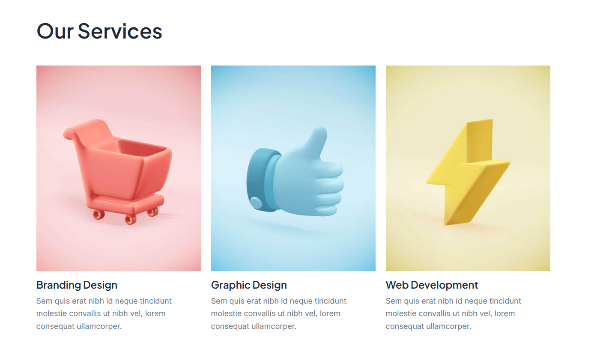
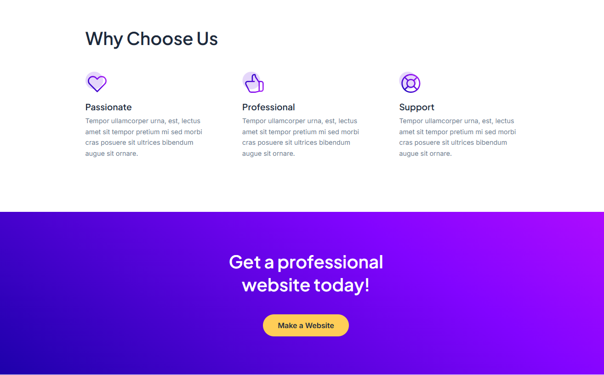
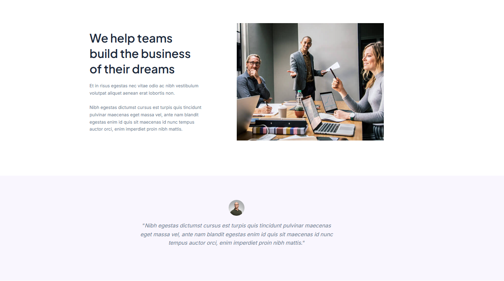
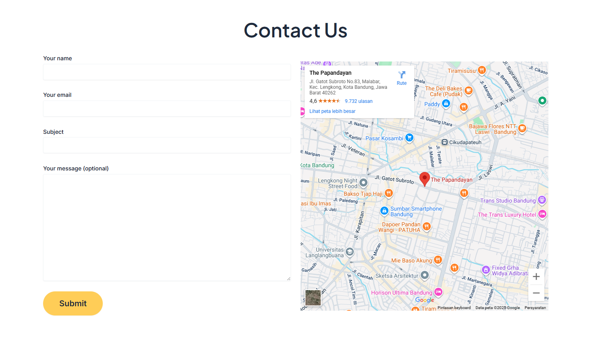

## TechNova – Company Profile Website

A simple **WordPress-based company profile website** for **TechNova Solutions**.  
This project demonstrates how to build a clean and professional business website using **custom WordPress theme setup, essential plugins, and impactful page structure**.

---

## Features

- **Company Profile Pages** (Home, About, Services, Portfolio, Contact)  
- **Custom WordPress Theme** based on **Astra** (lightweight & flexible)  
- **Essential Plugins**:
  - Elementor (drag-and-drop builder)
  - Contact Form 7 (contact form)
  - Yoast SEO (SEO optimization)
  - WP Super Cache (performance boost)
- **Responsive Design** (mobile & desktop ready)
- **Fast & Lightweight** setup for better performance
- Easy to customize and extend  

---

## Preview

#### Homepage

#### Services

#### Why Choose Us

#### Testimonial

#### Contact Us

---

## Purpose

This project is created as a portfolio showcase to demonstrate:

Building a professional business site with WordPress

Setting up a custom theme and essential plugins

Delivering a clean, responsive, and impactful design

---

## Author

Robby Bambang Nurdiansyah

Web Developer | QA Engineer | n8n Automation
